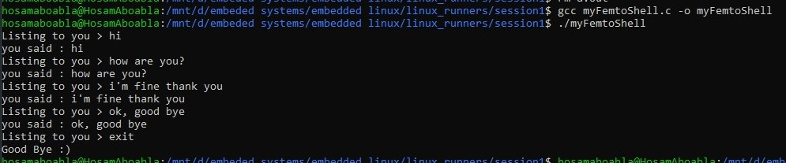

# Session 1
## Introdution to linux history, and linux basic commands


### Assignment #1
(Femto shell):
Write a femto shell program in c language that echoes any command entered by the user. The shell will have only one built-in command "exit". If the user entered "exit", the shell will reply with "Good Bye" and terminate.

## Compilation command
``` bash
$ gcc myFemtoShell.c -o myFemtoShell
```

## Useful Commands
* To search in man page
    ``` bash
    man -k pattern
    ```

* To search in file
    ``` bash
    $ grep pattern file_name/folder_name
    ```

* View content of file
    
    you will need to scroll using mouse wheel
    ``` bash
    $ cat file_name
    ```
    you can't go up again
    ``` bash
    $ more file_name 
    ```
    you can go up and down and search by writing /pattern and press q to exit
    ``` bash
    $ less file_name
    ``` 
    ``` bash
    $ head file_name
    $ tail file_name
    ```
* Vim

    - view file if exists or create new one
    - Quit without saving use :q!
    - Quit and save use :wq
    - Enter insert mode by pressing i
    - Exit insert mode by pressing Esc
    - Search using /pattern, and to get next occurrence press n
    ``` bash
    $ vim file_name
    ```
* gcc
    - Compile in one command
    ```bash
    $ gcc file_name.c
    ```
    - Preprocessing only
    ``` bash
    $ gcc -E file_name.c > hello.i
    ```
    - Assemply
    ``` bash
    $ gcc  -S file_name.i
    ```
    - Compile
    ```bash
    $ gcc -C hello.s
    ```
    - Linking
    ``` bash
    $ gcc -o myhello file_name.o
    ```
    - Excute
    ``` bash
    $ ./myhello
    ```

## OUTPUT



### [Recorded session]() by eng. Reda Maher many thanks to him😍

