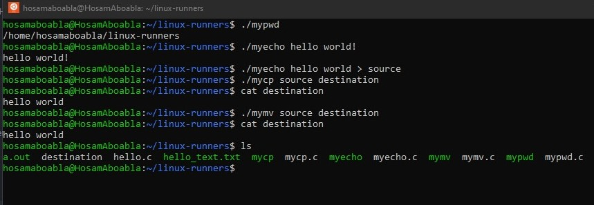

# Session 3

## - Introduction to system calls.
## - Command line arguments.
## - Implementing a simple cp command.

### Assignment #2
Write the following simple unix  utilities:
1- pwd: print working directory (check man getcwd)
2- echo: print a user input string on stdout (for example:  echo Hello World)
3- cp: copy a file to another file and keep the original one (equivalent to copy/paste)
4- mv: move a file to another file and remove the original one (equivalent to cut/paste) (check ).

### Compilation commands
``` bash
$ gcc mypwd.c -o mypwd
$ gcc myecho.c -o myecho
$ gcc mycp.c -o mycp
$ gcc mymv.c -o mymv
```
### OUTPUT


### Useful Commands

``` bash
$ man 2 intro
$ man 2 open
$ man 2 write
$ man 2 read
$ man 2 close
$ man 3 remove
$ man 3 printf
```


### [Recorded session]() by eng. Reda Maher many thanks to him😍

