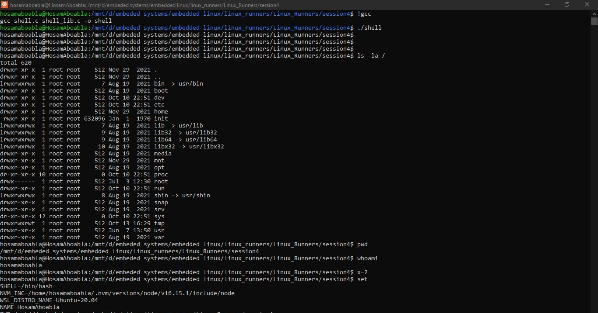

# Session 3

## - Introduction to system calls.
## - Command line arguments.
## - Implementing a simple cp command.


### Assignment #3 (Femto Shell Extension #1 )
Extend your femto shell to support the following features:
1- Executing external commands using fork and exec
2- Local and env variables where the env variables are passed to any child created by your shell while the local variables are not passed to the children.

### Compilation commands
``` bash
$ gcc shell.c shell_lib.c -o shell
```


### OUTPUT


### Useful Commands

``` bash
$ man strtok
$ man 2 execve
$ man gethostname
$ man setenv
$ man fork
$ man environ
$ indent -kr excuter.c
```


### [Recorded session]() by eng. Reda Maher many thanks to him😍